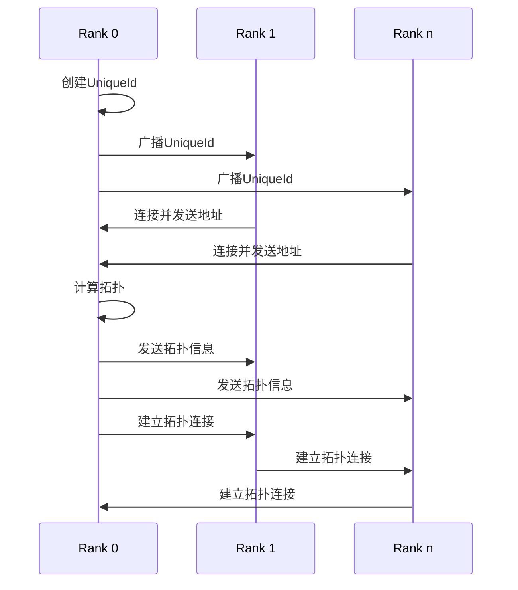

# 简化Bootstrap过程

```mermaid
sequenceDiagram
    participant R0 as Rank 0
    participant R1 as Rank 1
    participant Rn as Rank n
    
    R0->>R0: 创建UniqueId
    R0->>R1: 广播UniqueId
    R0->>Rn: 广播UniqueId
    
    R1->>R0: 连接并发送地址
    Rn->>R0: 连接并发送地址
    
    R0->>R0: 计算拓扑
    R0->>R1: 发送拓扑信息
    R0->>Rn: 发送拓扑信息
    
    R0->>R1: 建立拓扑连接
    R1->>Rn: 建立拓扑连接
    Rn->>R0: 建立拓扑连接
```

**说明**: 根节点生成ID并广播，各节点连接根节点交换地址，最后形成环形拓扑。
