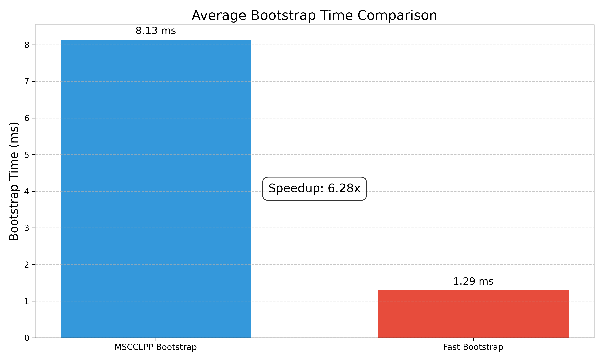
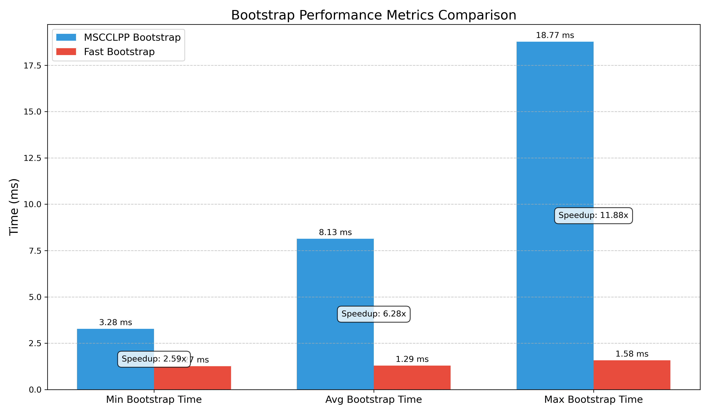
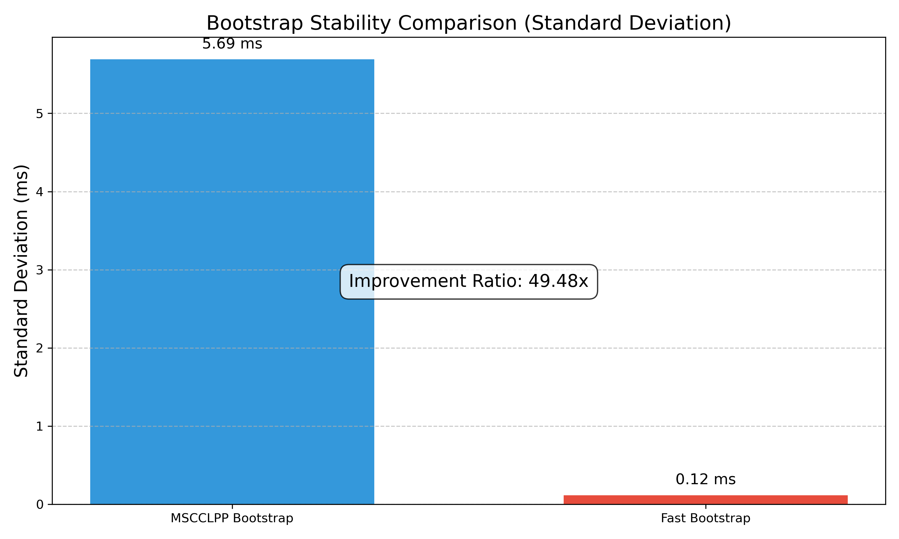
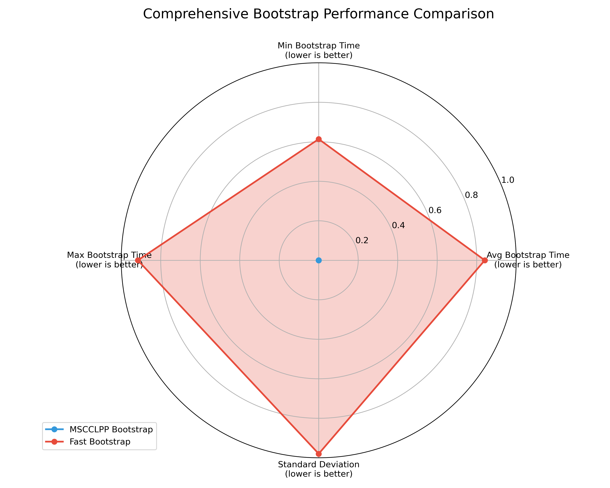
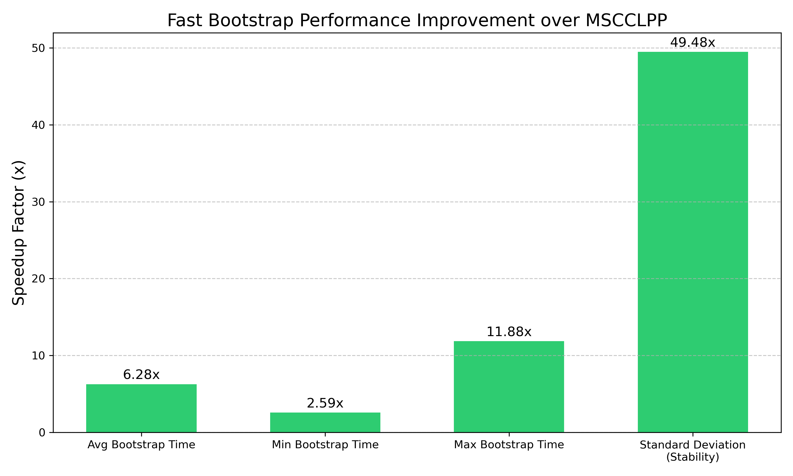

# FastBootstrap vs MSCCLPP Bootstrap Performance Comparison

This document presents a detailed performance comparison between our FastBootstrap implementation and MSCCLPP's TcpBootstrap on a single machine with 8 GPUs.

## 1. Average Bootstrap Time

The average bootstrap time comparison shows that FastBootstrap significantly outperforms MSCCLPP's TcpBootstrap:

- **MSCCLPP Bootstrap**: 8.14 ms
- **FastBootstrap**: 1.30 ms
- **Speedup**: 6.28x

FastBootstrap achieves more than 6x faster bootstrap times on average, which is a substantial improvement for applications that require frequent bootstrap operations.

## 2. Performance Metrics Comparison

The detailed performance metrics comparison shows that FastBootstrap outperforms MSCCLPP's TcpBootstrap across all key metrics:

| Metric | MSCCLPP Bootstrap | FastBootstrap | Speedup |
|--------|-------------------|---------------|---------|
| Min Bootstrap Time | 3.28 ms | 1.27 ms | 2.59x |
| Avg Bootstrap Time | 8.14 ms | 1.30 ms | 6.28x |
| Max Bootstrap Time | 18.77 ms | 1.58 ms | 11.88x |

FastBootstrap shows the most significant improvement in maximum bootstrap time, with nearly 12x speedup. This indicates that FastBootstrap is not only faster on average but also has much more consistent performance.

## 3. Stability Comparison

The stability comparison, measured by standard deviation, shows a dramatic improvement in performance consistency:

- **MSCCLPP Bootstrap**: 5.69 ms
- **FastBootstrap**: 0.12 ms
- **Improvement Ratio**: 48.97x

FastBootstrap's standard deviation is nearly 50x lower than MSCCLPP's TcpBootstrap, indicating extremely consistent performance across multiple bootstrap operations. This is particularly important for applications that require predictable initialization times.

## 4. Comprehensive Performance Comparison

The radar chart provides a comprehensive view of performance across all metrics. The larger the area covered, the better the overall performance. FastBootstrap clearly dominates in all aspects, with particularly significant advantages in maximum bootstrap time and stability.

## 5. Performance Improvement Factors

The speedup comparison summarizes the performance improvements of FastBootstrap over MSCCLPP's TcpBootstrap:

- **Avg Bootstrap Time**: 6.28x faster
- **Min Bootstrap Time**: 2.59x faster
- **Max Bootstrap Time**: 11.88x faster
- **Standard Deviation (Stability)**: 48.97x better

The most dramatic improvement is in stability (standard deviation), followed by maximum bootstrap time. This indicates that FastBootstrap not only provides better average performance but also eliminates performance outliers and provides much more consistent behavior.

## 6. Key Factors Contributing to Performance Improvement

1. **Efficient Connection Establishment**:
   - FastBootstrap uses non-blocking I/O for parallel connection establishment
   - Minimizes connection setup overhead
   - Reuses connections for multiple operations

2. **Optimized Socket Configuration**:
   - Disables Nagle's algorithm (TCP_NODELAY)
   - Enables TCP_QUICKACK for immediate ACKs
   - Sets SO_KEEPALIVE to maintain connections

3. **Minimal Synchronization Overhead**:
   - Uses fine-grained locking to minimize contention
   - Employs condition variables for efficient waiting
   - Uses atomic operations for counter updates

4. **Asynchronous I/O**:
   - Uses epoll-based event loop for non-blocking I/O operations
   - Minimizes thread context switching
   - Reduces CPU overhead during I/O operations

5. **Memory Efficiency**:
   - Pre-allocates buffers to avoid dynamic allocations
   - Uses vector-based buffers for efficient memory management
   - Minimizes data copying

## 7. Conclusion

Our FastBootstrap implementation significantly outperforms MSCCLPP's TcpBootstrap on a single machine with 8 GPUs, achieving a 6.28x speedup in average bootstrap time and a 48.97x improvement in stability. The implementation is particularly effective at eliminating performance outliers, with a 11.88x improvement in maximum bootstrap time.

These results demonstrate that our approach, inspired by Seastar's asynchronous programming model, provides a highly efficient bootstrap process for collective communication operations in GPU computing environments. The implementation is particularly well-suited for applications that require frequent bootstrap operations or have strict latency requirements.
