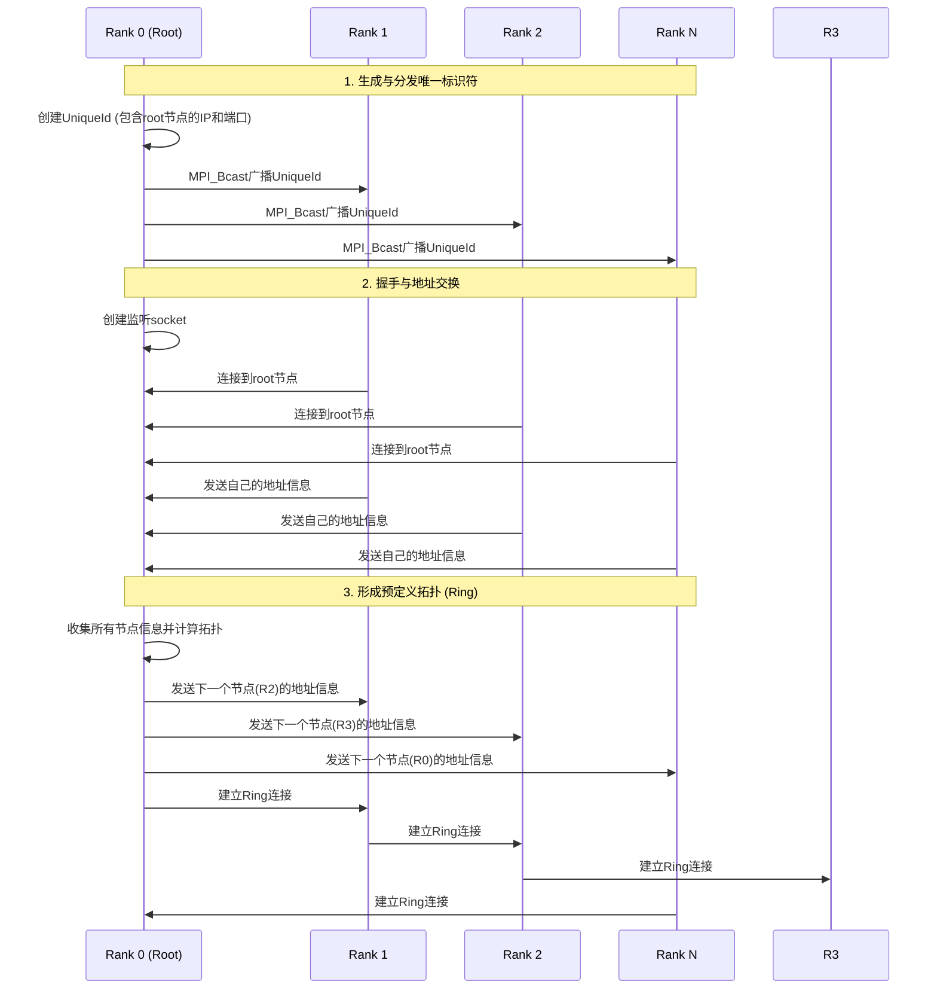

# Bootstrap建链过程简化时序图

下面的时序图展示了集合通信中bootstrap建链的核心过程：由根节点生成唯一标识符、广播到所有节点、握手交换地址信息，以及形成预定义拓扑。

## 简要说明

### 1. 生成与分发唯一标识符
- Rank 0 (根节点) 创建一个包含自身网络信息的唯一标识符 (UniqueId)
- 通过MPI_Bcast操作将这个标识符广播给所有其他节点
- 每个节点获取这个标识符，用于后续连接

### 2. 握手与地址交换
- 根节点创建一个监听socket，准备接收其他节点的连接
- 所有非根节点使用唯一标识符中的信息连接到根节点
- 每个节点向根节点发送自己的网络地址信息
- 根节点收集所有节点的地址信息

### 3. 形成预定义拓扑
- 根节点根据收集到的地址信息计算预定义拓扑结构（如Ring或Tree）
- 根节点将拓扑信息发送给各节点（如Ring拓扑中，告知每个节点其下一个节点的地址）
- 各节点根据收到的信息建立与指定节点的连接，形成最终的通信拓扑

这个简化的时序图展示了bootstrap过程的核心步骤，清晰地表达了从唯一标识符生成到最终拓扑形成的完整流程。
